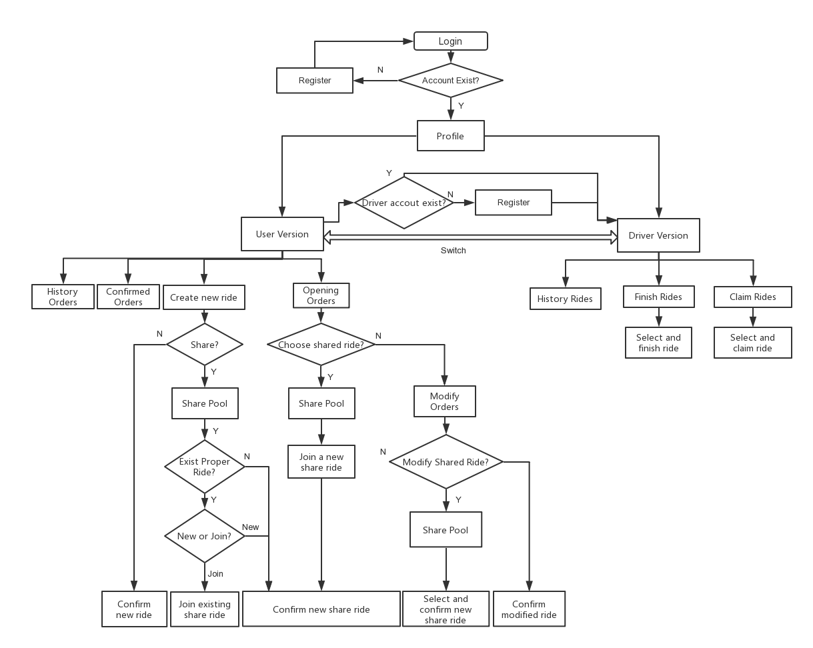

# erss-hwk1-wl177-nn75

This project is for ECE-568 Homework1
For this assignment you will be writing a web-app in Django. This web-app will let users request, drive for, and join rides.

## Summary 
I have completed these functions in this project:
1. Create a user account.
2. Login with a valid user account
3. Handle login failure with an an invalid user account.
4. Logout from a user session.
5. User should be able to register as a driver by entering their personal & vehicle info.
6. User should be able to view and edit their driver status as well as personal & vehicle info.
7. User should be able to submit a ride request by specifying the required and any combination of the optional info.
8. User should be able to make a selection to view any non-complete ride they belong to.
9. User should be able to make a selection to edit any open ride they belong to.
10. A ride owner should be able to edit the requested attributes of a ride until that ride is confirmed.
11. User should be able to view all ride details for any open ride they belong to.
12. User should be able to view all ride details + driver and vehicle details for any confirmed ride they belong to.
13. User should be able to search for sharable, open ride requests (by destination, arrival window, and # of passengers).
14. User should be able to join a ride returned in a search as described in requirement #13.
15. A registered driver should be able to search for open ride requests (filtered by the driver's vehicle capacity and type / special info, if applicable).
16. A registered driver should be able to mark a selected ride (returned from a search as described in requirement #15) as confirmed (thus claiming and starting the ride).
17. An email should be sent to the owner and any sharers of a ride once it is confirmed by a driver.
18. A driver should be able to see a list of their confirmed rides.
19. A driver should be able to select a confirmed ride and view all of the ride details.
20. A driver should be able to edit a confirmed ride for the purpose of marking it complete after the ride is over.

### E-R Model Design
<div align=center></div>

### Flow Chart
<div align=center></div>

## Getting Started

These instructions will get you a basic idea of how to run the web

### Docker Installation


```
sudo apt-get install docker.io
sudo pip install docker-compose
```

### Run the server
1. git clone 
2. cd erss-hwk1-wl177-nn75
3. sudo docker-compose up


## Function Introduction

### Login:
1. Create a new account by registration.
2. Alert if the account is invalid.
3. Alert if the password is wrong.

### Registration:
1. Alert if the username is already exists or the length is too short.
2. Alert if the email is already exisits or the format is wrong.
3. Alert if the password is too short.
4. Alert if the name is too short.
5. Alert if the the phone number format is wrong.

### Profile (customer version):    
1. The user can edit personal information, change password and logout.
2. The default version after login is customer version.
3. The information of the user is displayed.
4. Press "Driver Version" to change model from passenger to driver (with version switch reminder).
5. Alert and turn page to registration if the user does not register as driver before.
6. Press button "New Ride" to create a new ride.
7. Press button "Opening Rides" to view and modify orders.
8. Press button "Confirmed Rides" to view confirmed orders.
9. Press button "History Rides" to view history orders.

### New Ride (customer version):
1. Input information of rides.
2. The vehicle level (S/M/L) is the capacity of the car.
3. If not share the ride, press "Confirm" to view order information and confirm.
4. If share the ride, press "Confirm" to turn to share ride pool.

### Share Pool (customer version):
1. Print out the information of my request.
2. List all shareing rides have the same destination and in the time arange of 40 minutes (The start of users in one share party can be different).
3. Press button "New", if there's no proper ride for the user.
4. Press button "New", if you want to create new share ride instead of joining others.
5. Press button "Confirm", if you select one existing ride.

### Opening Rides (customer version):
1. List all the share and not-share orders.
2. Select one ride and press button "Modify" to modify the confirmed ride.
3. Select one ride and press button "Cancel".
4. If cancel not share ride, the ride will be canceled.
5. If cancel share ride with one user in it, the ride will be canceled.
6. If cancel share ride with more than one user, the passenger number on that ride will reduce accordingly.

### Modify Rides (customer version):
1. Change information and confirm, the order information would be updated.
2. If modify share ride and press confirm, it turns to share pool again for user to choose a new party.

### Confirmed Rides (customer version):
1. List all the orders claimed by drivers.
2. Press the driver's name to display the driver's information.

### History Rides (customer version):
1. List all the orders finished and canceled.

### Profile (driver version):    
1. The user can edit information (including special service), change password and logout.
2. Press button "Claim Ride" to claim a ride.
3. Press button "Finish Ride" to finish a ride.
4. Press button "History Ride" to view rides history.

### Claim Ride (Driver version):
1. List all the opening rides request from users.
2. Select one and press button "claim" to claim a ride.
3. Send emails to all the related customers.

### Finish Rides (Driver version):
1. List all the claimed rides.
2. Select one and press button "Finish" to finish a ride.

### History Rides (Driver version):
1. List all the finished rides.


## Built With

* [Django](https://www.djangoproject.com/)
* [PyCharm](https://www.jetbrains.com/pycharm/) 

## Authors

* **Wending Lin** (NetID: wl177)
* **Nan Ni** (NetID: nn75)